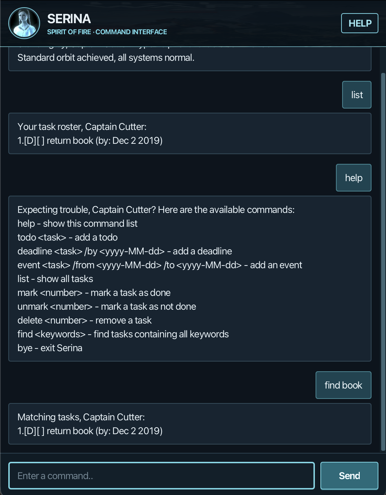

# Serina User Guide

Welcome aboard, Captain Cutter! Serina tracks todos, deadlines, and events through a Halo-inspired chat interface.
Type short commands; your tasks are saved automatically on your computer.

[Quick start](#quick-start) · [Commands](#features) · [Saving and backups](#saving-and-backups) ·
[Troubleshooting](#troubleshooting)

## Quick start

1. Install **Java 25** using the [Java installation guide](https://se-education.org/guides/tutorials/javaInstallation.html).
   On macOS, use **Zulu JavaFX 25.0.3** (`25.0.3.fx-zulu`), as required by this project.
2. Download the JAR file from [Serina's releases](https://github.com/kimjunkuno/ip/releases).
   Choose the `.jar` asset. If named `ip.jar`, rename it to `serina.jar`.
3. Put `serina.jar` in a folder where you can save files. Open a terminal in that folder and run:

   ```text
   java -jar serina.jar
   ```

4. Type `todo Read a book` in the bottom input box and press **Enter** or click **Send**.
   Type `list` to see your task. A fresh installation starts empty.



Resize the window and scroll to revisit messages. Serina calls your task list the “roster.”

## Features

### Command format

- Replace placeholders such as `<task>`, `<number>`, and `<date>` with your own values; omit the angle brackets.
- Enter one command per submission. Task descriptions may contain spaces, punctuation, or Chinese characters.
- Command names ignore case (`LIST` works). Date markers `/by`, `/from`, and `/to` must be lowercase,
  separated from other text by spaces, and appear once in the order shown.
- Dates use `yyyy-MM-dd`, for example `2026-09-20`. Times are not supported. Dates display as `Sep 20 2026`.
- Extra spaces between command parts are accepted. `help`, `list`, and `bye` take no arguments.

You can store up to **100 tasks**, including completed ones. Duplicate tasks of the same type, description,
and dates are rejected, even if capitalization, extra spaces, or completion status differ.

### Add a todo: `todo`

Adds a task without a date.

Format: `todo <task>`

Example: `todo Read a book`

Adds `[T][ ] Read a book` to the end of your roster.

### Add a deadline: `deadline`

Adds a task due on a date.

Format: `deadline <task> /by <date>`

Example: `deadline Submit project report /by 2026-09-20`

The task appears as `[D][ ] Submit project report (by: Sep 20 2026)`.

### Add an event: `event`

Adds a task spanning multiple dates.

Format: `event <task> /from <start-date> /to <end-date>`

Example: `event Study camp /from 2026-09-21 /to 2026-09-23`

The task appears with an `[E]` marker and both dates. The end must be **later than** the start;
same-day events and impossible dates such as `2026-02-30` are rejected.

### View your roster: `list`

Format: `list`

Shows all tasks, including completed ones, in the order they were added:

```text
Your task roster, Captain Cutter:
1.[T][ ] Read a book
2.[D][ ] Submit project report (by: Sep 20 2026)
3.[E][ ] Study camp (from: Sep 21 2026 to: Sep 23 2026)
```

`[T]` means todo, `[D]` deadline, and `[E]` event. `[ ]` means incomplete; `[X]` means complete.

**Task numbers always refer to the full roster returned by `list`.** Run `list` before marking or deleting a task,
especially after a search or deletion. Deleting a task changes the numbers of later tasks.

### Find tasks: `find`

Format: `find <keywords>`

Example: `find proj rep` matches `Submit project report`.

Every keyword must occur in the same description. Matching ignores case and keyword order, and accepts partial
words. Dates and status markers are not searched. If nothing matches, Serina suggests trying other keywords.

**Search results have their own numbering, which cannot be used to select tasks for other commands.**
For example, the report above is result `1` in this search, but remains task `2` in the full roster.
Use `list`, then `mark 2` to complete it.

### Complete or reopen a task: `mark` and `unmark`

Format: `mark <number>` or `unmark <number>`

Examples: `mark 1` changes task 1 to `[X]`; `unmark 1` changes it back to `[ ]`.

Use a positive whole number from `list`. Repeating the same action is harmless.

### Delete a task: `delete`

Format: `delete <number>`

Example: `delete 1` removes task 1 from the full roster.

Deletion takes effect immediately, with **no confirmation or undo**. Check `list` first.
To change a description or date, delete the old task and add its replacement; there is no edit command.

### Show commands: `help`

Format: `help`

Displays the command reference in the chat. Clicking **Help** also preserves your unfinished input.

### Close Serina: `bye`

Format: `bye`

Closes the chat window and ends the application. Successful changes have already been saved.

## Saving and backups

Every successful task change is saved automatically. Chat history is not restored.

Tasks are stored in `data/serina.txt`, relative to the folder you launch Serina from. Always launch from the same
folder to see the same roster. The `data` folder and save file are created automatically when needed.

To back up or transfer tasks, close Serina and copy `data/serina.txt` somewhere safe. To restore, close Serina,
back up any existing file, then copy your saved file into the launch folder's `data` directory and restart.
Use commands rather than editing the save file by hand.

## Troubleshooting

| Problem | What to do |
| --- | --- |
| Java is missing or the app will not launch | Run `java -version` in the same terminal and confirm Java 25. On macOS, use the JavaFX distribution specified above. |
| “Unable to access jarfile” | Open the terminal in the folder containing the JAR and check its filename matches `serina.jar`. |
| A command shows an error | Read the highlighted error, correct the text kept in the input box, and resubmit. Use `help` to check the format. |
| Tasks seem to have disappeared | Check that you launched from the usual folder and that its `data/serina.txt` is present. |
| Saving failed | The change was not applied. Check free disk space and write access to the launch folder and `data` folder, then retry. |
| Saved tasks could not be loaded | Close Serina and back up the file. Check read access or restore a known-good backup, then restart. An invalid record may be identified by line number. |

After a load failure, task commands are blocked to protect your file; `help` and `bye` remain available.
If you choose to start fresh, close Serina and **move the old save file to a backup location** before restarting.
